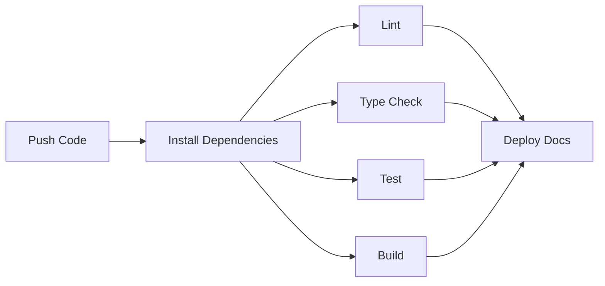

# 架构设计

Aether UI 采用 Monorepo 架构，基于 pnpm + Turborepo 构建，提供高效的开发体验和灵活的包管理。

## 项目结构

```
aether-ui/
├── packages/              # 核心包
│   ├── core/             # 核心组件库
│   ├── streaming/        # 流式渲染引擎
│   └── docs/             # 文档站点
├── apps/                 # 应用
│   └── playground/       # 组件演示应用
├── configs/              # 共享配置
│   ├── eslint-config/    # ESLint 配置
│   ├── typescript-config/# TypeScript 配置
│   └── tailwind-config/  # Tailwind 配置
├── scripts/              # 构建脚本
├── .github/              # GitHub Actions
├── package.json          # 根配置
├── pnpm-workspace.yaml   # pnpm 工作空间配置
└── turbo.json            # Turborepo 配置
```

## 架构图

```mermaid
graph TB
    subgraph "应用层"
        A[playground]
        B[docs]
    end

    subgraph "组件层"
        C[@proton-ui/core]
        D[@proton-ui/streaming]
    end

    subgraph "配置层"
        E[eslint-config]
        F[typescript-config]
        G[tailwind-config]
    end

    A --> C
    A --> D
    B --> C
    B --> D
    C --> D
    C --> E
    C --> F
    C --> G
    D --> E
    D --> F
```

## 核心包

### @proton-ui/core

核心组件库，包含所有基础组件和对话组件。

**主要功能：**

- 基础组件（Button、Input、Card）
- 对话组件（Message、ChatContainer、MessageInput）
- 主题系统（ThemeProvider、defaultTheme）
- 工具函数（cn）

**技术栈：**

- React 18
- TypeScript
- Tailwind CSS
- react-markdown
- rehype-highlight

**构建配置：**

- 使用 tsup 构建
- 输出 ESM 和 CJS 格式
- 生成类型声明文件
- 支持 tree-shaking

### @proton-ui/streaming

流式渲染引擎，提供高性能的流式文本渲染能力。

**主要功能：**

- StreamingRenderer 核心类
- useStreamingText Hook
- StreamingText 组件
- 虚拟补全算法

**核心特性：**

- 批处理渲染
- RAF 节流
- 帧率控制
- 性能监控

**技术实现：**

- requestAnimationFrame 调度
- 增量内容更新
- 智能批处理
- 暂停/恢复控制

## 技术选型

### Monorepo 管理

**pnpm + Turborepo**

选择理由：

- **pnpm**：高效的磁盘空间利用，快速的安装速度
- **Turborepo**：智能的任务编排，增量构建，远程缓存

优势：

- 统一的依赖管理
- 高效的构建流程
- 灵活的包发布
- 良好的开发体验

### 构建工具

**tsup**

选择理由：

- 零配置的 TypeScript 构建
- 基于 esbuild，构建速度快
- 支持多种输出格式
- 自动生成类型声明

配置示例：

```typescript
// tsup.config.ts
import { defineConfig } from "tsup";

export default defineConfig({
  entry: ["src/index.ts"],
  format: ["esm", "cjs"],
  dts: true,
  splitting: false,
  sourcemap: true,
  clean: true,
  external: ["react", "react-dom"],
});
```

### 样式方案

**Tailwind CSS**

选择理由：

- 原子化 CSS，灵活高效
- 优秀的开发体验
- 内置响应式和暗色模式
- 易于定制和扩展

优势：

- 减少 CSS 体积
- 避免样式冲突
- 提升开发效率
- 统一的设计语言

### 代码规范

**ESLint + Prettier + Husky**

工具链：

- **ESLint**：代码质量检查
- **Prettier**：代码格式化
- **Husky**：Git hooks 管理
- **lint-staged**：增量检查
- **commitlint**：提交信息规范

配置：

```javascript
// .eslintrc.js
module.exports = {
  extends: ["@proton-ui/eslint-config"],
  rules: {
    // 自定义规则
  },
};
```

### 版本管理

**Changesets**

选择理由：

- 自动化版本管理
- 生成 CHANGELOG
- 支持独立版本
- 简化发布流程

工作流程：

1. 开发完成后创建 changeset
2. 运行 `changeset version` 更新版本
3. 运行 `changeset publish` 发布包

## 构建流程

### 开发模式

```bash
# 启动所有包的开发模式
pnpm dev

# 启动特定包
pnpm --filter @proton-ui/core dev
```

### 构建流程

```bash
# 构建所有包
pnpm build

# 构建特定包
pnpm --filter @proton-ui/core build
```

Turborepo 会自动：

- 分析包依赖关系
- 按正确顺序构建
- 缓存构建结果
- 只构建变更的包

### CI/CD 流程



GitHub Actions 配置：

```yaml
name: CI

on: [push, pull_request]

jobs:
  test:
    runs-on: ubuntu-latest
    steps:
      - uses: actions/checkout@v3
      - uses: pnpm/action-setup@v2
      - uses: actions/setup-node@v3
        with:
          node-version: 18
          cache: "pnpm"
      - run: pnpm install
      - run: pnpm lint
      - run: pnpm type-check
      - run: pnpm test
      - run: pnpm build
```

## 包依赖关系

```mermaid
graph TD
    A[@proton-ui/core] --> B[@proton-ui/streaming]
    A --> C[eslint-config]
    A --> D[typescript-config]
    A --> E[tailwind-config]
    B --> C
    B --> D
    F[playground] --> A
    F --> B
    G[docs] --> A
    G --> B
```

## 性能优化

### 构建优化

1. **增量构建**：Turborepo 缓存构建结果
2. **并行构建**：多个包并行构建
3. **Tree-shaking**：移除未使用的代码
4. **代码分割**：按需加载组件

### 运行时优化

1. **虚拟滚动**：大数据量场景优化
2. **批处理渲染**：减少渲染次数
3. **RAF 节流**：避免过度渲染
4. **React.memo**：避免不必要的重渲染

### 包体积优化

1. **外部化依赖**：React、React-DOM 等作为 peer dependencies
2. **按需导入**：支持 tree-shaking
3. **代码压缩**：生产构建自动压缩
4. **类型声明分离**：类型文件单独输出

## 开发工作流

### 1. 创建新组件

```bash
# 在 packages/core/src/components 创建组件目录
mkdir packages/core/src/components/NewComponent

# 创建组件文件
touch packages/core/src/components/NewComponent/NewComponent.tsx
touch packages/core/src/components/NewComponent/types.ts
touch packages/core/src/components/NewComponent/index.ts
```

### 2. 开发和测试

```bash
# 启动开发模式
pnpm dev

# 在 playground 中测试组件
cd apps/playground
pnpm dev
```

### 3. 编写文档

```bash
# 在 packages/docs/docs/components 创建文档
touch packages/docs/docs/components/new-component.mdx

# 启动文档服务器
pnpm docs:dev
```

### 4. 提交代码

```bash
# 添加 changeset
pnpm changeset

# 提交代码（会自动运行 lint 和 format）
git add .
git commit -m "feat(core): add NewComponent"
```

### 5. 发布包

```bash
# 更新版本
pnpm changeset version

# 发布到 npm
pnpm changeset publish
```

## 最佳实践

### 组件开发

1. **单一职责**：每个组件只负责一个功能
2. **组合优于继承**：使用组合式 API 设计
3. **类型安全**：完整的 TypeScript 类型定义
4. **无障碍性**：遵循 WAI-ARIA 标准

### 代码组织

1. **清晰的目录结构**：按功能模块组织代码
2. **统一的命名规范**：使用 PascalCase 命名组件
3. **导出规范**：使用 barrel exports（index.ts）
4. **文档完善**：每个组件都有详细的文档

### 性能考虑

1. **避免过度渲染**：使用 React.memo、useMemo、useCallback
2. **懒加载**：大组件使用 React.lazy
3. **虚拟化**：大列表使用虚拟滚动
4. **批处理**：合并多次状态更新

## 扩展性

### 添加新包

1. 在 `packages/` 目录创建新包
2. 配置 `package.json`
3. 在 `pnpm-workspace.yaml` 中注册
4. 在 `turbo.json` 中配置构建任务

### 添加新配置

1. 在 `configs/` 目录创建配置包
2. 导出共享配置
3. 在其他包中引用

### 集成新工具

1. 在根 `package.json` 添加依赖
2. 配置工具（如 `.eslintrc.js`）
3. 在 `turbo.json` 添加任务
4. 更新 CI/CD 流程

## 总结

Aether UI 的架构设计注重：

- **开发效率**：Monorepo + Turborepo 提供高效的开发体验
- **代码质量**：完善的工具链确保代码质量
- **性能优化**：多层次的性能优化策略
- **可维护性**：清晰的结构和规范的代码组织
- **可扩展性**：灵活的架构支持快速扩展

这些设计使得 Aether UI 既适合小型项目快速开发，也能支撑大型项目的长期维护。
